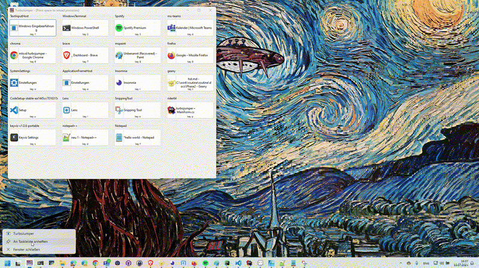

# TurboJumper

Fast application switcher for Windows. Instead of Alt+Tab cycling, TurboJumper shows your configured apps as buttons, click one or press its key and you're there.



## How it works

On launch, TurboJumper shows buttons only for the apps you've whitelisted. Each button gets a keyboard shortcut (1–9, Q–P, A–L, Z–M). Shortcuts are active only while TurboJumper is focused, so they don't interfere with anything else.

**Space** refreshes the list when you open new apps.

## Setup

Pin TurboJumper to the leftmost position on the taskbar, then Win+1 opens it from anywhere.

## Configure

Click **Configure** to manage which apps appear and in what order. You can set a custom key per app, enable/disable entries individually, or pick from currently running processes to add them quickly.

Config is saved to `%APPDATA%\TurboJumper\process-config.json`. On first run a default list is created (Chrome, Edge, Firefox, VS Code, Slack, Teams, Spotify, Visual Studio, Discord, Explorer, Notepad).

## Build & run

```
git clone https://github.com/mlsvd/turbojumper
```

Open `TurboJumper.sln` in Visual Studio and press F5, or:

```
dotnet run --project TurboJumper/TurboJumper.csproj
```

## License

MIT — see [LICENSE](LICENSE.md).
